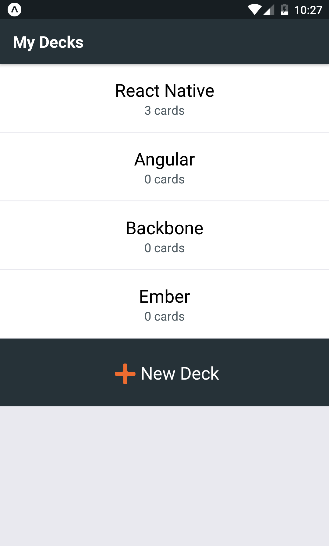
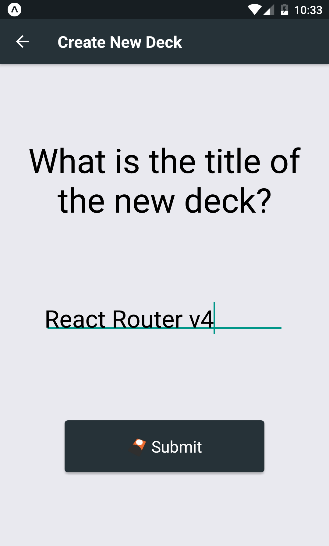
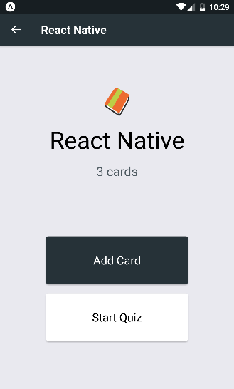
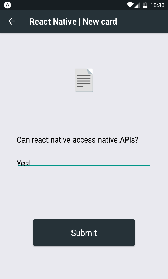
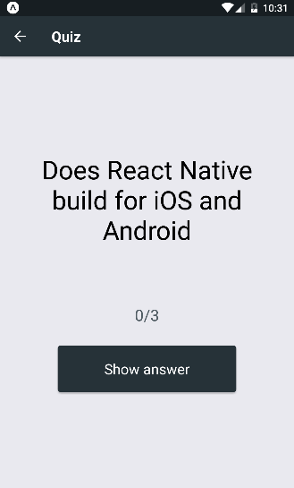
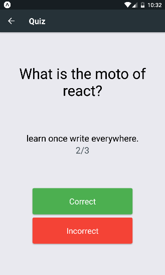
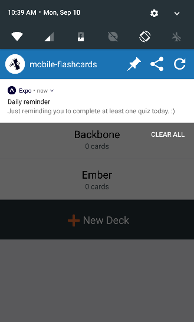

# Mobile Flashcards

> Build and decks and play with flashcards to test your knowledge.

[](https://github.com/standard/standard)

## Install

```
yarn install
```

## Usage

```
yarn start
```

Run the app using any of the options provided on the terminal.
The app has been tested and developed on a Genymotion android simulator.

## Screenshots











## License

MIT © Matheus Alencar